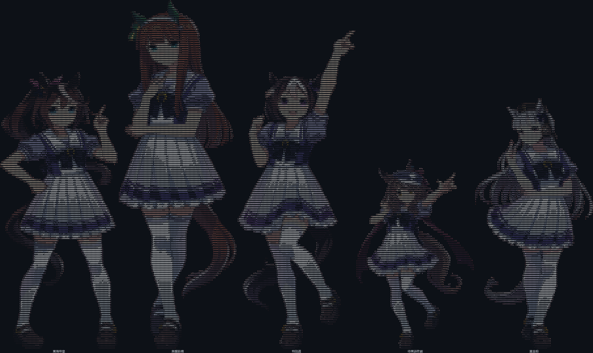

# Hi there, I'm YurielYoung ฅ(• ɪ •)ฅ

## 🐾 Welcome to my little corner of GitHub!

> (ﾉ´ヮ`)ﾉ*: ・゚✧  
> A game server developer who writes code with cats on the lap and dogs by the feet.

---

### 🐱 About Me

```text
  ╱|、      Hi! I'm YurielYoung
(˚ˎ 。7    A game server developer
 |、˜〵     Passionate about C# / .NET / Actor model
 じしˍ,)ノ   Always learning, always growing
```

- 🎮 Game Server Developer (C# / .NET)
- 🏗️ Distributed systems · Actor model · Redis · NATS
- 🌱 Currently exploring AI + DevOps
- 🐱 Cat person who also loves dogs
- 📫 Reach me: just open an issue!

---

### 🐶 Tech Stack


---

### 🐱 GitHub Stats

<div align="center">


</div>

---

### 🐎 Cute Corner — 赛马娘 ASCII Art

<div align="center">



</div>

---

### 🦴 Visitor Count

<div align="center">


</div>

---

<div align="center">

```text
  Thanks for visiting! (´• ᵕ •`)
  ┳━┳ ノ( ゜-゜ノ)  ← 桌子还在
```

⭐️ From [YurielYoung](https://github.com/YurielYoung)

</div>
